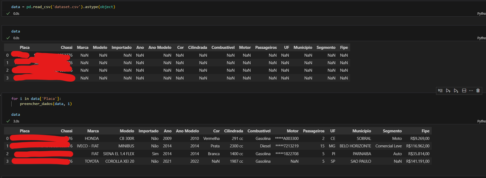

# Web Scraping de Veículos por Placa

Este projeto consiste em um notebook Python que realiza web scraping em sites como placafipe.com ou keplaca.com para extrair informações de veículos a partir da placa. As informações extraídas incluem:

- Marca
- Modelo
- Importado
- Ano
- Ano Modelo
- Cor
- Cilindrada
- Combustível
- Motor
- Passageiros
- UF
- Município
- Segmento
- Valor FIPE

Depois de extrair essas informações, elas são atualizadas em uma tabela desejada.

## Funcionalidades

- Realiza web scraping de informações de veículos a partir da placa.
- Extrai múltiplas informações úteis sobre o veículo.
- Atualiza essas informações em uma tabela.

## Exemplo de Dataset

Um exemplo de dataset está disponível em [dataset.csv](dataset.csv). Este arquivo contém um exemplo das informações extraídas por meio do web scraping.


## Imagem da Extração

A imagem abaixo mostra um exemplo da extração de informações de um veículo a partir de uma placa:



## Como Usar

1. **Clonar o repositório:**

   ```bash
   git clone https://github.com/danttis/veiculos-placa-web-scraping.git
   cd veiculos-placa-web-scraping
   ```

2. **Instalar as dependências:**

   Certifique-se de ter instalado todas as bibliotecas necessárias. Você pode instalar as dependências usando o seguinte comando:

   ```bash
   pip install pandas requests beautifulsoup4
   ```

3. **Executar o notebook:**

   Execute o notebook `buscar-placas.ipynb` no Jupyter Notebook ou Jupyter Lab.
